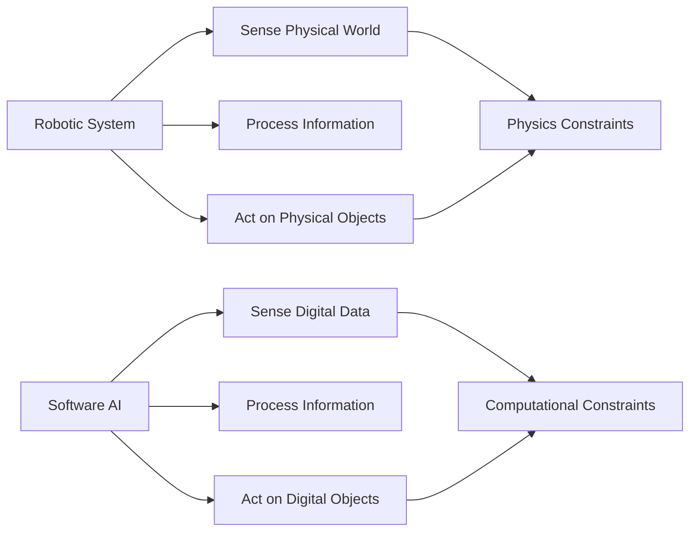

# Robotics vs Software Intelligence

## Learning Objectives

By the end of this chapter, you will be able to:

- Distinguish between robotics and software-based AI systems
- Analyze the fundamental differences in problem-solving approaches
- Understand the unique challenges and opportunities in each domain
- Evaluate when to apply robotic vs software solutions
- Recognize the synergies between robotics and software AI

## Defining the Domains

### Robotics

Robotics is an interdisciplinary field that combines mechanical engineering, electrical engineering, computer science, and other disciplines to design, construct, operate, and apply robots. A robot is typically defined as a programmable machine that can carry out a series of complex actions automatically, especially one programmable by a computer.

Key characteristics of robotic systems:
- **Physical embodiment**: Existence in three-dimensional space
- **Actuation**: Capability to perform physical actions
- **Sensing**: Ability to perceive the physical environment
- **Autonomy**: Capacity to operate independently
- **Interaction**: Direct engagement with physical objects and environments

### Software Intelligence

Software intelligence refers to AI systems that operate primarily in digital environments. These systems process information, recognize patterns, make decisions, and generate outputs without direct physical interaction with the world.

Key characteristics of software AI systems:
- **Virtual existence**: Operate in digital spaces
- **Information processing**: Manipulate abstract data representations
- **Simulation capability**: Model and predict outcomes without physical consequences
- **Scalability**: Can be replicated and distributed easily
- **Speed**: Can process information rapidly without physical constraints

## Fundamental Differences

### 1. Embodiment and Interaction

**Robots** exist in physical space and must deal with the laws of physics, material properties, and real-world constraints. Their intelligence is shaped by their physical form and the need to interact with tangible objects.

**Software AI** operates in virtual environments where the primary constraints are computational resources and data availability. Physical laws don't apply to the same extent.

### 2. Real-time Constraints

**Robots** must operate in real-time, responding to environmental changes within strict temporal bounds. Delays in perception or action can lead to failure or damage.

**Software AI** can often operate offline, processing information without immediate time pressure, allowing for more computationally intensive algorithms.

### 3. Uncertainty and Noise

**Robots** face sensor noise, actuator inaccuracies, and environmental uncertainties that directly impact their ability to function. They must be robust to these physical uncertainties.

**Software AI** deals with data quality issues but typically has cleaner, more structured input data compared to the messy real-world signals robots receive.

### 4. Resource Constraints

**Robots** operate under physical resource constraints: limited battery life, payload capacity, computing power constrained by heat dissipation, and material durability.

**Software AI** scales more easily with additional computational resources and doesn't face the same physical limitations.

## Problem-Solving Approaches

### Robotics Approach

Robotic systems often employ:

- **Behavior-based architectures**: Decomposing complex tasks into simpler behaviors
- **Reactive control**: Responding directly to environmental stimuli
- **Hybrid deliberative/reactive systems**: Combining planning with reactive responses
- **Learning from demonstration**: Acquiring skills through physical interaction
- **Embodied cognition**: Leveraging physical form for computation

### Software AI Approach

Software AI systems typically utilize:

- **Symbolic reasoning**: Manipulating abstract representations
- **Statistical learning**: Identifying patterns in large datasets
- **Optimization algorithms**: Finding optimal solutions mathematically
- **Knowledge representation**: Encoding and manipulating explicit knowledge
- **Simulation-based planning**: Modeling outcomes before execution

## Complementary Strengths

### Robotics Strengths

- **Direct physical interaction**: Can manipulate objects and environments directly
- **Real-world grounding**: Grounded in physical reality, reducing simulation-reality gaps
- **Embodied learning**: Learn through physical experience and interaction
- **Human-like interaction**: Natural interface with humans in physical space
- **Environmental adaptation**: Can modify and adapt to physical environments

### Software AI Strengths

- **Speed and scale**: Process vast amounts of information rapidly
- **Precision**: Perform calculations with high numerical accuracy
- **Memory capacity**: Store and recall massive amounts of information
- **Consistency**: Reproducible behavior without fatigue
- **Connectivity**: Access and integrate information from multiple sources

## Challenges in Each Domain

### Robotics Challenges

1. **Reality Gap**: Discrepancies between simulations and real-world performance
2. **Safety**: Ensuring safe operation around humans and valuable property
3. **Durability**: Maintaining functionality in varied and challenging environments
4. **Cost**: Physical systems are typically more expensive than software
5. **Maintenance**: Physical components require ongoing maintenance and repair

### Software AI Challenges

1. **Data dependency**: Performance heavily dependent on training data quality
2. **Interpretability**: Understanding and explaining AI decision-making
3. **Robustness**: Vulnerability to adversarial attacks and edge cases
4. **Generalization**: Difficulty transferring learning across domains
5. **Ethical considerations**: Bias, privacy, and societal impact concerns

## Convergence and Synergies

Modern AI development increasingly recognizes the value of combining robotic and software approaches:

### Cloud Robotics

Robots leverage cloud-based software AI for:
- Complex computation and planning
- Large-scale learning from robot fleets
- Knowledge sharing between robots
- Advanced perception and recognition

### Simulation-to-Reality Transfer

Software AI trained in simulation can be transferred to physical robots through:
- Domain randomization techniques
- Sim-to-real transfer learning
- Physics-informed neural networks
- Adversarial domain adaptation

### Hybrid Systems

Combining the strengths of both approaches:
- Software AI handles high-level reasoning and planning
- Robotic systems execute physical actions
- Continuous learning between digital and physical domains

## Case Studies

### Case Study 1: Warehouse Automation

**Robotic Component**: Physical robots navigate warehouses, pick and place items
**Software Component**: Optimization algorithms schedule tasks, predict demand
**Synergy**: Software intelligence optimizes operations while robots execute physically

### Case Study 2: Autonomous Vehicles

**Robotic Component**: Physical vehicles with sensors and actuators
**Software Component**: Perception, prediction, and planning algorithms
**Synergy**: Software processes sensor data and plans routes while vehicle executes driving

### Case Study 3: Surgical Robots

**Robotic Component**: Precise physical manipulation tools
**Software Component**: Image processing, motion planning, haptic feedback
**Synergy**: Software enhances surgeon's capabilities while robot provides precision

## Choosing Between Approaches

### When to Choose Robotics

- Physical manipulation is required
- Human-robot interaction in physical space
- Environmental modification is needed
- Real-world grounding is essential
- Safety requires physical presence

### When to Choose Software AI

- Information processing is the primary need
- Scale and speed are critical
- Physical risks are prohibitive
- Cost of physical systems is prohibitive
- Experimentation without physical consequences

### When to Combine Both

- Complex tasks requiring both reasoning and manipulation
- Human-AI collaboration in physical environments
- Learning that benefits from both simulation and reality
- Applications requiring both digital and physical capabilities

## Future Directions

The boundary between robotics and software AI continues to blur as both fields advance:

- **Digital twins**: Virtual replicas of physical systems for enhanced control
- **Edge AI**: Bringing software intelligence to physical devices
- **Swarm robotics**: Coordinating multiple physical agents with centralized intelligence
- **Human-AI teams**: Combining human intelligence with both robotic and software AI

## Exercises

1. Identify three applications where robotics is essential and three where software AI suffices. Justify your choices based on the characteristics discussed in this chapter.

2. Describe a scenario where the combination of robotics and software AI would be superior to either approach alone. Explain the specific synergies realized.

3. Research and compare the development timelines for a complex robotic system versus a complex software AI system. What factors contribute to the differences?

4. Discuss the ethical implications of deploying robotic systems versus software AI systems. How do the physical capabilities of robots change the ethical landscape?

## Further Reading

- Siciliano, B., & Khatib, O. (Eds.). (2016). *Springer Handbook of Robotics*
- Russell, S., & Norvig, P. (2020). *Artificial Intelligence: A Modern Approach* (4th ed.)
- Murphy, R. R. (2019). *Introduction to AI Robotics* (2nd ed.)
- Goodfellow, I., Bengio, Y., & Courville, A. (2016). *Deep Learning*